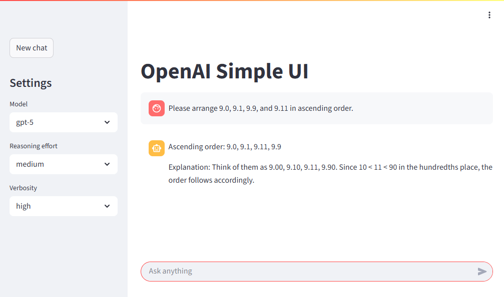

# OpenAI Simple UI

A minimal Streamlit-based chat UI for OpenAI models (example list: `gpt-5.1`, `gpt-5.1-chat-latest`, `gpt-5`, `gpt-5-mini`, `gpt-5-nano`). It lets you adjust `reasoning_effort` and `verbosity` from the sidebar and streams tokens as they arrive.

## Features

- Very small chat interface using `st.chat_message`
- OpenAI Python SDK v1 streaming (`client.chat.completions.create(stream=True, ...)`)
- Sidebar controls for `reasoning_effort` (high / medium / low / minimal / none) and `verbosity` (high / medium / low)
- Easy to extend the model list
- Runs locally or via container (Podman / Docker)

## Project Structure

```text
.
├── Dockerfile
├── build.sh              # Build image (tags with current date)
├── container.sh          # Example Podman run script
├── script.sh             # Local run script
├── template_container.sh # Template for container run
├── template_script.sh    # Template for local run
└── src/
    ├── openai-simple-ui.py
    ├── requirements.txt
    └── run.sh            # Startup script (custom baseUrlPath etc.)
```

## Screenshot



## Prerequisites

- Python 3.12+
- An OpenAI API key (`OPENAI_API_KEY` environment variable)

## Local Run

```bash
git clone <repo>
cd openai-simple-ui
python -m venv .venv
source .venv/bin/activate
pip install -r src/requirements.txt
export OPENAI_API_KEY=sk-...  # Your key (do NOT commit it)
streamlit run src/openai-simple-ui.py --browser.gatherUsageStats=false
```

## Container Run (Podman example)

```bash
./build.sh                 # produces image: openai-simple-ui:YYYYMMDD
export OPENAI_API_KEY=sk-...
podman run -d \
  -p 8511:8501 \
  -e OPENAI_API_KEY=${OPENAI_API_KEY} \
  --name openai-simple-ui \
  openai-simple-ui:YYYYMMDD
```

Use `docker` instead of `podman` if you prefer Docker.

`src/run.sh` sets:

```text
--server.baseUrlPath /simple-openai
--server.address 10.0.2.100
--server.port 8501
```

Remove or edit those flags if you don’t need a custom base path or address binding.

## Environment Variables

| Name | Description | Required |
|------|-------------|----------|
| OPENAI_API_KEY | OpenAI API key | Yes |

Example `.env` file:

```env
OPENAI_API_KEY=sk-...
```

Load it (bash):

```bash
export $(grep -v '^#' .env | xargs)
```

## Code Outline

1. Stores conversation in `st.session_state["messages"]` (role + content)
2. On user input, appends the user message
3. Streams assistant response token-by-token and updates the placeholder

Model list lives here:

```python
model_options = ["gpt-5", "gpt-5-mini", "gpt-5-nano"]
```

Add or remove entries as needed.

## Dependency Management

Pinned versions in `src/requirements.txt`. To add a package:

```bash
pip install <package>
pip freeze > src/requirements.txt   # optionally prune unrelated packages first
```

## Customization Examples

| Requirement | How |
|-------------|-----|
| Add model | Append to `model_options` list |
| Remove base path | Delete `--server.baseUrlPath` from `run.sh` |
| Change port | Adjust `--server.port` or container port mapping |
| Persist history | Replace in-memory list with DB (SQLite, Redis, etc.) |

## Troubleshooting

| Symptom | Fix |
|---------|-----|
| 401 Unauthorized | Check / re-export `OPENAI_API_KEY` |
| 404 under base path | Verify reverse proxy path & trailing slash |
| Output stops mid-sentence | Streaming artifact; aggregate chunks then render |

## Security Notes

- Keep secrets (API keys) out of version control even if files are `.gitignore`d.
- Rotate any key that was ever committed.

## Roadmap Ideas

- DB-backed conversation history
- Robust retry & error handling
- Tool / multimodal extensions
- Theme / dark mode improvements

## License

See `LICENSE`.

Contributions (issues / PRs) are welcome.
